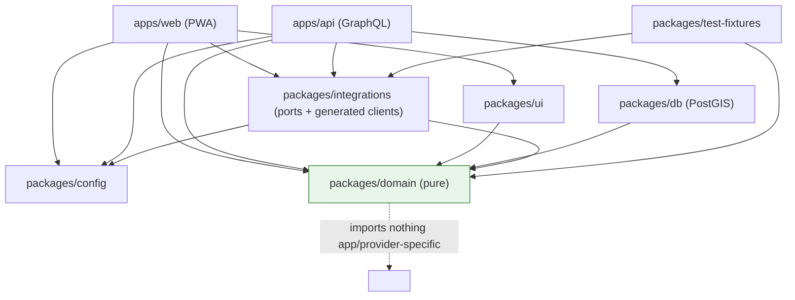

# FoodMap — Dependency Graph

Package boundaries enforce that **pure logic stays framework- and provider-free** and that
**provider payloads never leak** into domain/GraphQL/UI contracts.

## Allowed dependency directions

- `domain` depends on **nothing** in the repo except its own types (no React, no Next, no
  Prisma, no provider SDKs, no `config`). It is the stable core: geometry, discovery rules,
  glossary types, validation schemas.
- `db` depends on `domain` (for types) only; owns PostGIS + repositories.
- `integrations` defines the **ports** and holds **generated** GraphQL clients; depends on
  `domain` + `config`. Concrete provider adapters live here, hidden behind ports.
- `ui` depends on `domain` (types) — never on `api`/`db`/providers.
- `config` is leaf-ish: typed runtime config + kill switches; depends on `domain` types only.
- `apps/web` and `apps/api` are composition roots that wire adapters to ports.
- `test-fixtures` provides deterministic scenarios to `domain`/`integrations` consumers and
  is used by tests + the simulator; never shipped to production bundles.

## Forbidden edges (lint-enforced later)

- `domain → {web, api, db, ui, config, integrations, any provider SDK}` ❌
- `ui → {api, db, provider SDK}` ❌
- provider adapter types → `domain | GraphQL schema | UI props` ❌ (normalize first)
- any FoodMap package → Herald source packages ❌ (network adapter only; see ADR-0002)
