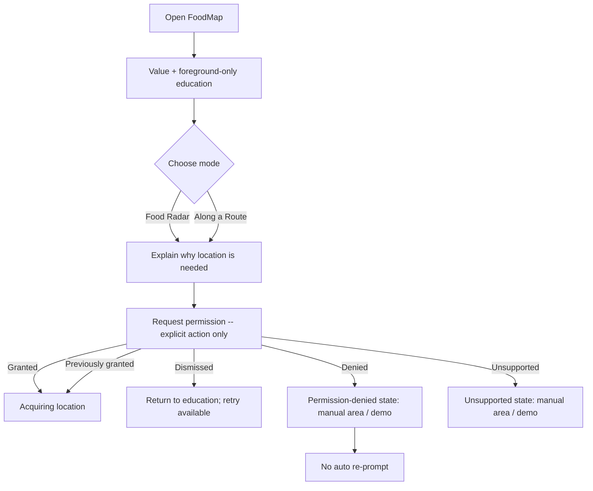
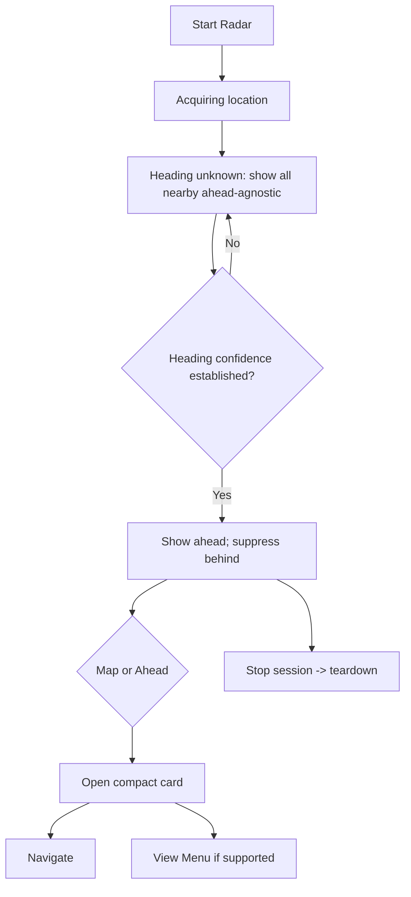
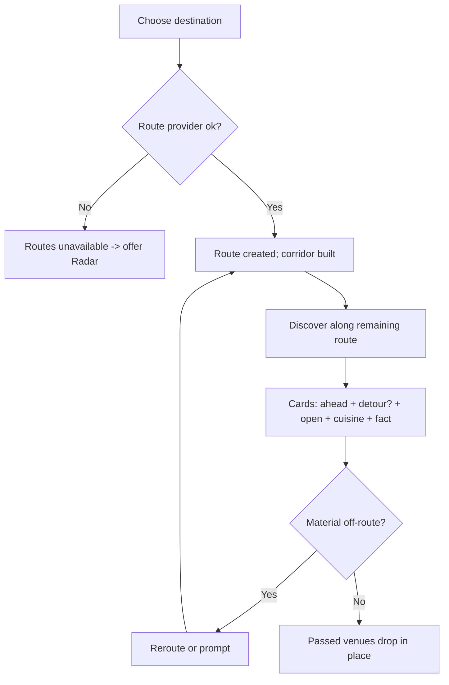
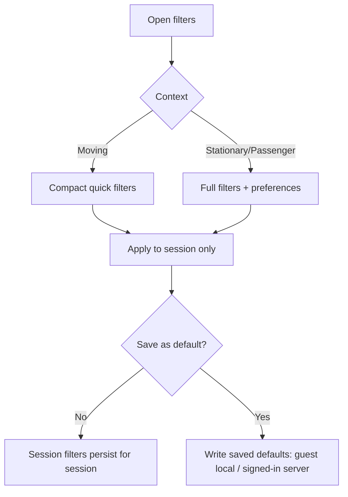
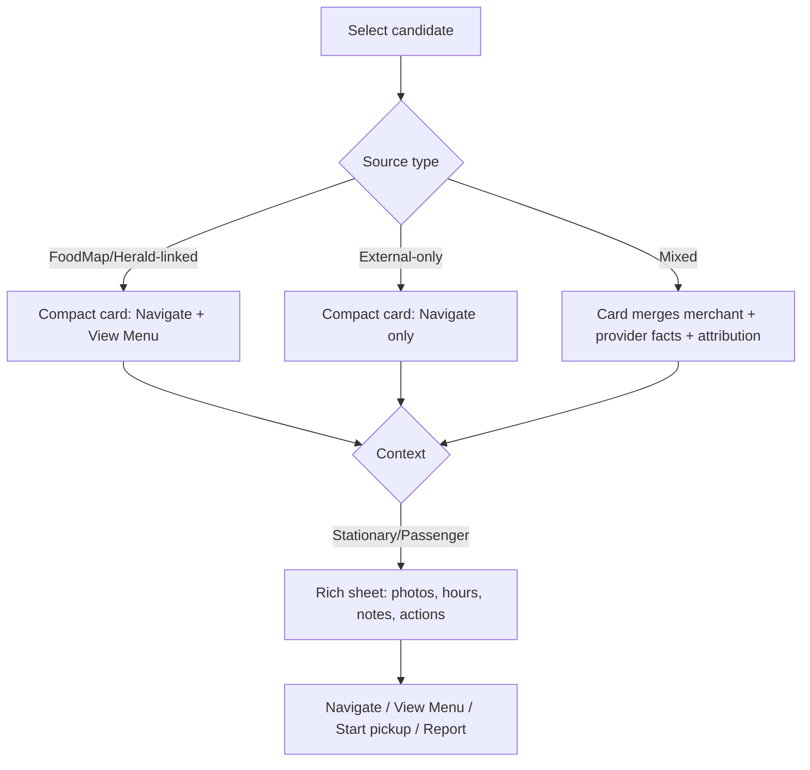
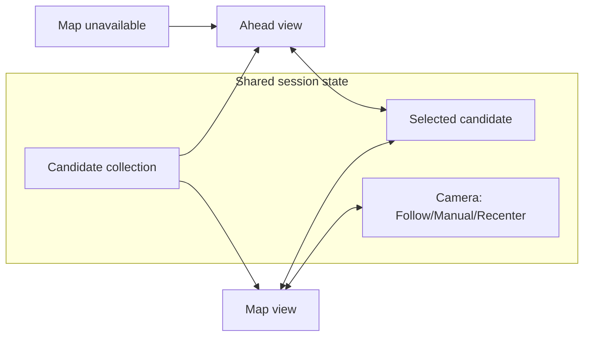

# FoodMap — User Flows

Six required journeys + degraded states, plus the shared Map/Ahead interaction model. Each
journey lists numbered steps and a mermaid flow. Presentation contexts (`moving_compact`,
`unknown_compact`, `stationary_rich`, `passenger_rich`) and safety rules (never auto-open,
never auto-navigate, phone-holder ≠ driver) apply throughout.

---

## Journey 1 — First launch & permission

1. User opens FoodMap.
2. App explains the value + **foreground-only** location use.
3. **No** location permission prompt appears automatically.
4. User chooses **Food Radar** or **Along a Route**.
5. Location permission requested **only after** that explicit action.
6. Handle: grant · dismiss · deny · previously-granted · unsupported.
7. Denial must **not** create a permission-prompt loop.
8. Manual area / demonstration mode remains available.

---

## Journey 2 — Food Radar

1. Start Food Radar. 2. Acquiring location. 3. Direction initially **unknown**.
4. Heading confidence grows. 5. Restaurants **ahead** appear.
6. Restaurants behind suppressed **only when direction is trustworthy**.
7. Switch Map ↔ Ahead. 8. Open a restaurant card. 9. Choose Navigate or View Menu.
10. User **explicitly** stops the session (clears watchers/timers/requests).

---

## Journey 3 — Along a Route

1. Choose destination. 2. Route created. 3. Show restaurants along the **remaining** route.
4. Cards show: time/distance ahead · exact added detour when available · open status · cuisine
   · a concise distinguishing fact.
5. Already-passed restaurants disappear **without chaotic list movement**.
6. Off-route / rerouting / route-provider-failure states clearly designed.
7. User may switch to Food Radar if route mode is unavailable.

---

## Journey 4 — Filters & preferences

Design: cuisine multi-select · Open Now · time↔distance emphasis · max time ahead · max
distance ahead · max route detour · bounded result count · reset session filters · save as
default · guest preference persistence · signed-in synchronization.

**Session changes do not automatically become permanent defaults.** Compact filter surface for
moving use; full filter/settings surface for stationary use.

---

## Journey 5 — Restaurant decision

Three cases: **(1)** FoodMap-owned or Herald-linked venue · **(2)** external-only venue ·
**(3)** linked venue with both merchant-owned and provider-owned info.

- **Compact card (moving):** name · time/distance ahead · cuisine · open state · exact detour
  where available · Navigate · View Menu **only when supported**.
- **Rich sheet (stationary/passenger):** larger image · rating + count · address · hours ·
  entrance/parking notes · specialties · delivery/pickup availability · source + attribution ·
  report incorrect information.

Do not show unsupported actions as disabled promises — **omit** them. External-only venues
never imply Herald ordering.

---

## Journey 6 — Degraded states

For each condition, state **what happened**, **what remains usable**, **safest recovery**. Full
table in [operations/failure-matrix.md](../operations/failure-matrix.md). Covered: permission
denied · geolocation unavailable · acquiring · poor GPS accuracy · heading unknown · offline ·
external places unavailable · routes unavailable · map unavailable · details/photo unavailable ·
exact detour unavailable · no restaurants nearby · all filtered out · stale candidates · session
stopped · feature disabled.

---

## Map & Ahead interaction model (shared)

Map and Ahead represent the **same candidate collection**.

- One **shared selected restaurant**: marker selection highlights the Ahead row and vice-versa;
  switching views **preserves selection**.
- **Harmless location updates must not reorder** the full list; candidate updates change values
  **in place** rather than animate every row.
- Map camera states: **Follow · Manual · Recenter**. **Manual pan must not snap back**
  automatically.
- **Map failure leaves Ahead fully functional**; every map action also exists in Ahead.
- Route mode shows the **remaining** route, not the travelled route.

